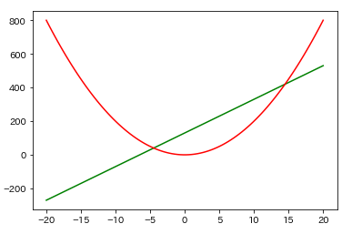
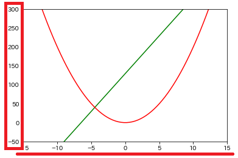
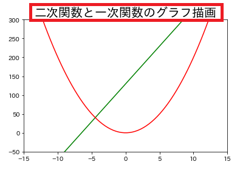
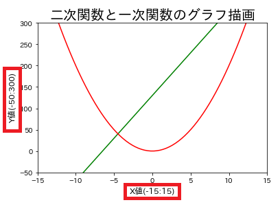
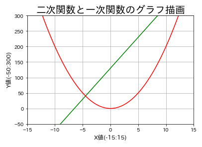
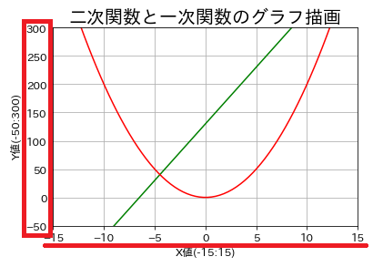
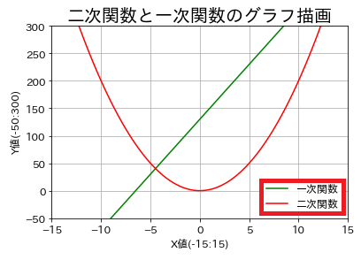

# 数学の二次関数と一次関数をグラフ描画
グラフ描画と共にグラフ装飾を行う

<br>

## 二次関数と一次関数をグラフ描画


<br>

## X値とY値の範囲を指定してグラフ表示範囲を制限
```
plt.xlim(-15, 15)
plt.ylim(-50, 300)
```


<br>

## グラフタイトルを表示
```
plt.title('二次関数と一次関数のグラフ描画', fontsize=20)
```


<br>

## X軸とY軸のラベル設定
```
plt.xlabel('X値(-15:15)', fontsize=12)
plt.ylabel('Y値(-50:300)', fontsize=12)
```


<br>

## グリッド線を表示
```
plt.grid(True)
```


<br>

## X軸とY軸の目盛のパラメータ設定
```
plt.tick_params(labelsize=12)
```


<br>

## 凡例の表示
```
plt.legend(loc="lower right", fontsize=12)
```


<br>
